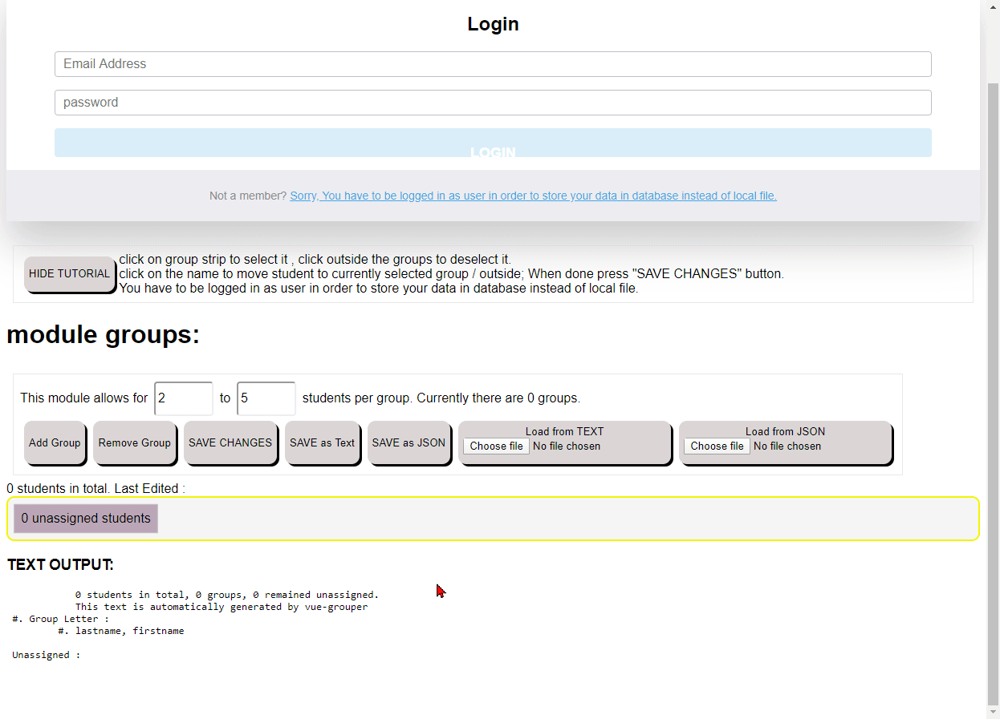

# Student Grouper

[working demo](Osmiogrzesznik.github.io/vue-grouper/public)

Quick and dirty Vue tool for grouping students for assignments. No components , routing , or state management. Simply put folder with files in any place. No need for server or building with node tools. Quickly group people and deliver report to teacher. 
Primary purpose of this tool is to prepare a list of student groups submitted to tutors, 
Secondary option is enabling students
to submit the changes to the list online. (requires Firebase)

## Persistence

Opens/Saves:
 - JSON
 - list of newline separated names
 - List format text file generated as output. 
 
At the bottom of the there is dynamically updated text output that will be saved to text file. 

Secondary data persistence method uploads data to firebase, you have to be logged in. 

look at [files folder](https://github.com/Osmiogrzesznik/vue-grouper/tree/master/public/files) to check valid formats. 

## Pictures

If loaded from JSON with img property

if loaded from newline separated text file or generated lists file

